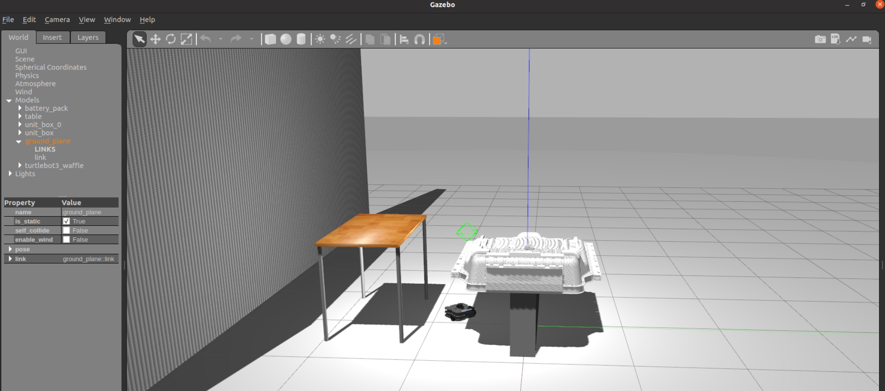
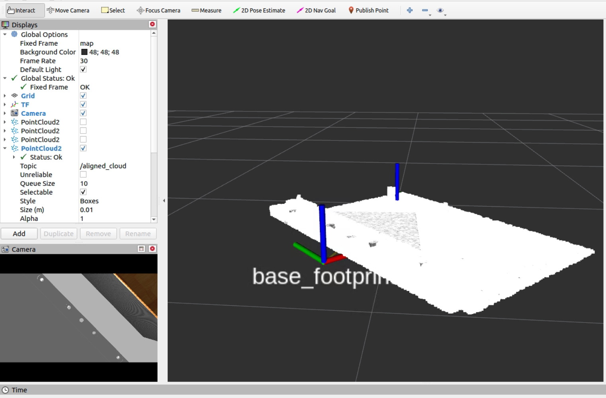

Here’s the updated **README** file including the images for Gazebo and RViz:

---

# Battery Pack - Relative Pose Estimator

This repository contains all the files and scripts used for estimating relative pose between objects using point cloud processing and ICP (Iterative Closest Point) techniques. It also includes files for handling object-to-point cloud conversions and point cloud visualization.

### Overview

The primary model used in this repository is the **Niro battery pack from Hyundai**, which has been converted into point cloud data for processing and testing. Please note that the CAD model is not provided in this repository due to its status as **confidential internal company data**.

---

## How to Run

To launch the ROS package, use the following command:

```bash
roslaunch rel_pos_estimator test.launch
```

This will initiate the test setup for the relative pose estimator.

---

## Files in the Repository

### 1. **Python Scripts**
- **`obj2pcd.py`**  
  This script includes functions to:
  - Convert `.obj` files to `.pcd` files.
  - Filter point clouds based on specific axis ranges and generate statistical summaries.
  
  **Usage:**  
  Update the paths in the script to your specific `.obj` and `.pcd` file locations and run the script for conversions or filtering.

---

### 2. **C++ Files**
- **`pcl_icp.cpp`**  
  Implements the ICP algorithm for aligning point clouds and estimating relative poses.  
  **Dependencies:** Ensure you have the Point Cloud Library (PCL) installed and configured.

- **`target_extraction.cpp`**  
  Focuses on extracting specific targets from a point cloud dataset for further processing.

- **`view_pcd.cpp`**  
  Provides visualization functionalities for point clouds.

---

### 3. **ROS Launch File**
- **`test.launch`**  
  A ROS launch file to initialize and test the components of this project.

---

## Usage Workflow

1. Convert your `.obj` model files (e.g., the Hyundai Niro battery pack) to `.pcd` using `obj2pcd.py`.
2. Preprocess and filter the `.pcd` file based on your requirements.
3. Use `pcl_icp.cpp` to estimate relative pose or align point clouds.
4. Visualize the point clouds using `view_pcd.cpp`.
5. Launch the ROS package for real-time testing and visualization.

---

## Visualization

### 1. Gazebo Simulation Environment
The Gazebo environment simulates the real-world setup, including the Niro battery pack model, a table, and other elements required for testing. 



---

### 2. RViz Visualization
RViz displays the transformed CAD model aligned with the observed object using the estimated relative pose.



---
